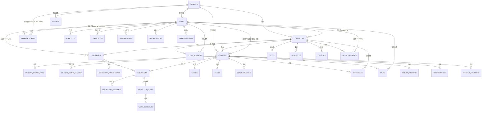

# TeachHub 数据库 ER 图

> 更新：2026-09-19 ｜ 数据库：MySQL 8.0（InnoDB，外键强制）｜ 表数：34 张 ｜ 迁移：23 个 revision（线性单链，head `d5e6f7a8b9c0`）

## 一、实体关系总览（Mermaid）

## 二、表清单（按域分组，34 张）

| 域 | 表名 | 关键字段 | 说明 |
| --- | --- | --- | --- |
| 租户/基础 | `schools` | name(唯一)、code(唯一)、status | 学校（active/disabled） |
| | `classrooms` | school_id、teacher_id、is_graduated | 班级（班主任 + 毕业标记） |
| | `class_teachers` | class_id + teacher_id（联合唯一） | 班级-教师多对多（科任） |
| | `students` | class_id、student_no(唯一)、is_dropped_out | 学生档案（通学/寄宿） |
| 认证 | `users` | username、role、school_id、class_id | 登录账号（4 角色 + 安全字段） |
| | `refresh_tokens` | user_id、school_id、token_hash(唯一) | 刷新令牌（F3）：仅存 sha256 摘要，`expires_at` 过期 / `revoked_at` 撤销 / `replaced_by` 轮换链；`user_id` 级联删、`school_id` 置空删 |
| 作业 | `assignments` | class_id、created_by、deadline | 作业任务 |
| | `assignment_attachments` | assignment_id | 作业附件（一对多） |
| | `submissions` | assignment_id、student_id | 作业提交 |
| | `submission_comments` | submission_id、teacher_id、score | 提交点评 |
| | `excellent_works` | submission_id(唯一)、selected_by | 优秀作品 |
| | `work_comments` | excellent_id、user_id | 作品评论 |
| 工作台 | `scores` | student_id、subject、score、exam_name | 成绩 |
| | `leaves` | student_id、start/end_date、status | 请假 |
| | `communications` | student_id、method | 家校沟通 |
| | `resources` | name、category、filepath | 教学资源 |
| | `exams` | title、exam_type、filepath | 试卷 |
| | `seats` | class_id(唯一)、layout(JSON) | 座位表 |
| | `settings` | school_id(可空) + key（联合唯一） | 系统设置：`school_id` 非空=校内配置，**`NULL`=平台全局配置**（如 `allow_registration`） |
| | `import_history` | import_type、user_id | 导入历史 |
| | `student_profile_tags` | student_id、tag | 画像标签 |
| | `weekly_reports` | class_id、title、data_snapshot | 班级周报 |
| | `student_board_history` | student_id、old/new_type | 住宿变更历史 |
| | `attendance` | class_id + student_id + date(唯一)、status | 每日考勤 |
| 班级日志 | `work_logs` | teacher_id、date | 工作日志 |
| | `class_plans` | teacher_id、plan_type | 班级计划/总结 |
| | `teacher_plans` | teacher_id、plan_type | 个人计划/总结 |
| | `schedules` | class_id、day_of_week、period | 课程表 |
| | `activities` | class_id、title、filepath(TEXT) | 班级活动；`filepath` 存图片路径 JSON 数组（历史字段，现图片内嵌于 `content` 的 Markdown） |
| | `talks` | student_id、teacher_id、images(TEXT) | 师生谈心；`images` 存图片路径 JSON 数组（历史字段，现图片内嵌于 `content`） |
| | `return_records` | student_id、return_date | 返校记录 |
| | `performances` | student_id、ptype、points | 表现（积极/消极） |
| | `student_comments` | student_id、content | 学生评语 |
| 审计 | `operation_logs` | user_id、action、class_id | 操作审计日志 |

## 三、外键删除策略分层

MySQL InnoDB 强制外键约束，删除策略已按「关系语义」分层：

### 1. CASCADE（17 个，纯从属关系）

从属数据随父记录删除自动级联：

| 子表 | 外键 | 父表 |
| --- | --- | --- |
| `assignment_attachments` | assignment_id | assignments |
| `submissions` | assignment_id / student_id | assignments / students |
| `excellent_works` | submission_id | submissions |
| `work_comments` | excellent_id | excellent_works |
| `submission_comments` | submission_id | submissions |
| `scores` | student_id | students |
| `leaves` | student_id | students |
| `communications` | student_id | students |
| `attendance` | student_id | students |
| `performances` | student_id | students |
| `talks` | student_id | students |
| `return_records` | student_id | students |
| `student_comments` | student_id | students |
| `student_profile_tags` | student_id | students |
| `student_board_history` | student_id | students |
| `refresh_tokens` | user_id | users |

### 2. RESTRICT（默认，归属/操作人关系）

以下外键**保持 RESTRICT**（不级联、不置空），删教师/班级/学校时需由代码显式处理，以保留业务数据语义：

- `users.school_id` / `users.class_id` → 账号归属
- `classrooms.teacher_id` / `classrooms.school_id` → 班级归属
- `students.school_id` / `students.class_id` → 学生归属
- `assignments.created_by` / `class_id` → 作业归属
- `excellent_works.selected_by`、`submission_comments.teacher_id`、`work_comments.user_id` → 操作人
- `talks.teacher_id`、`work_logs.teacher_id`、`class_plans.teacher_id` 等 → 教师归属
- `weekly_reports.created_by`、`import_history.user_id` → 创建人
- `schools.created_by` → 学校创建人

> 代码双保险：`cleanup.py` 的 `purge_student_data()` / `purge_user_data()` 在删除学生/账号时按「叶子 → 根」拓扑显式级联清理，与 DB CASCADE 兼容（先删子表再删父表，无副作用）。

### 3. SET NULL（1 个，租户归属可空）

| 子表 | 外键 | 父表 | 说明 |
| --- | --- | --- | --- |
| `refresh_tokens` | school_id | schools | 学校删除后令牌保留但失去租户归属（平台超管的令牌本即为 `NULL`） |

## 四、特殊关联（非外键软关联）

| 关系 | 关联方式 | 说明 |
| --- | --- | --- |
| 学生账号 ↔ 学生档案 | `users.class_id + name` = `students.class_id + name` | 无外键，通过 `get_student_account()` / `get_student_by_account()` 定位 |
| 头像 | 存于 `users.avatar` | 学生档案不冗余存储，通过软关联取账号头像 |
| 平台级全局配置 | `settings.school_id IS NULL` | 唯一约束为 `(school_id, key)`，而 MySQL 唯一索引**不约束 NULL**，因此全局键的去重由应用层保证——统一走 `app/platform_settings.py` 的 `get_global_setting` / `set_global_setting`（先查后写，不直接 INSERT） |
