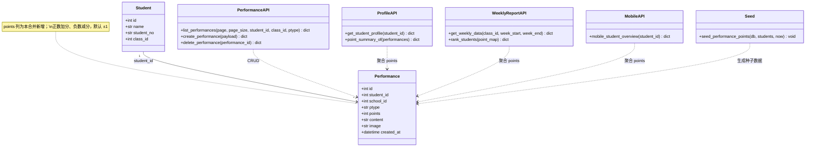
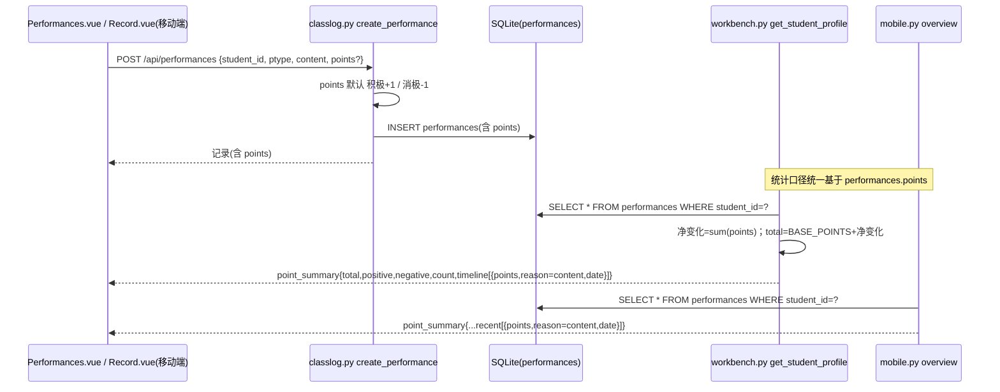
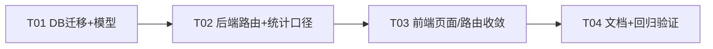

# 积分管理 → 表现管理 合并重构设计（保留表现管理）

> 项目：TeachHub（Vue3 + Element Plus / FastAPI + SQLAlchemy + SQLite + Alembic）
> 原则：最小变更、不引入新依赖、保证表现管理功能完整与性能不降、移动端不受破坏。

---

## Part A: System Design

### 1. 重叠分析结论

#### 1.1 引用清单（逐文件核实结果）

**后端（积分专属 = 删除；共享 = 改造保留）**

| 文件 | 位置 | 性质 |
|---|---|---|
| `backend/app/models/workbench.py` | L37-48 `Point` 模型 | 积分专属，删除 |
| `backend/app/models/__init__.py` | L7、L46 `Point` 导出 | 积分专属，删除 |
| `backend/app/routers/workbench.py` | L20 import；L299-364 `GET/POST /api/points`、`DELETE /api/points/{id}` | 积分专属端点，删除 |
| `backend/app/routers/workbench.py` | L969-976、L1018 学生画像 `point_summary`/雷达品德维度 | 共享统计，改基于 Performance |
| `backend/app/routers/workbench.py` | L1164-1180、L1189-1197、L1214 周报 top5/bottom5、`profile_summaries.points` | 共享统计，改基于 Performance |
| `backend/app/routers/classlog.py` | L10 import；L443-463 `create_performance` 联动建 Point；L478 `delete_performance` 联动删 Point | 共享逻辑，去掉联动 |
| `backend/app/routers/mobile.py` | L17 import；L95-106、L145 移动端画像 `point_summary`/品德维度 | 共享统计，改基于 Performance |
| `backend/app/seed.py` | L29/L133 import；L361-374 独立积分种子；L376-402 表现+联动积分种子；L630 打印积分条数 | 积分专属，重写种子逻辑 |
| `backend/app/config.py` | L11 `BASE_POINTS = 100` | 共享常量，**保留** |
| `backend/clean_data.sql` | L21 `DELETE FROM points;` | 积分专属，删除该行 |
| `backend/alembic/versions/*` | `d69fb0ac8fd6`(建表)、`a89fda91c31a`(加 performance_id FK)、`c9d8e7f6a5b4`(school_id) | 历史迁移，**不改动**，新增一个迁移收口 |
| `backend/tests/` | 无任何 point/performance 引用（已核实 grep 零命中） | 无需改 |
| `backend/app/main.py`、`backend/app/tenant.py` | 无直接 Point 引用（已核实） | 无需改 |

**前端**

| 文件 | 位置 | 性质 |
|---|---|---|
| `frontend/src/views/admin/Points.vue` | 整个文件（119 行） | 积分专属页面，删除 |
| `frontend/src/router/index.js` | L54 `/admin/points` 路由 | 积分专属，删除 |
| `frontend/src/layout/AdminLayout.vue` | L47 菜单项、L167 面包屑映射 | 积分专属，删除 |
| `frontend/src/api/index.js` | L110-114 `pointApi` | 积分专属，删除 |
| `frontend/src/views/admin/Performances.vue` | L47-50、L81-86 已有 points 输入；表格缺分值列 | 表现管理页，吸收分值展示 |
| `frontend/src/views/admin/StudentProfile.vue` | L140-146、L217、L256 消费 `point_summary` | 共享消费方，后端保持响应结构 → **零改动** |
| `frontend/src/views/admin/WeeklyReport.vue` | L41、L50、L186-198 消费 top5/bottom5/profile_summaries | 共享消费方，后端保持响应结构 → **零改动** |
| `frontend/src/mobile/views/StudentOverview.vue` | L29 `point_summary.total` | 移动端共享消费方，**零改动** |
| `frontend/src/mobile/views/Record.vue` | 用 `performanceApi.create`（不带 points，走默认±1） | 零改动 |
| `frontend/src/views/admin/AuditLogs.vue` | L95-96 `create_point/delete_point` 中文映射 | **保留**（历史审计日志仍可读） |
| `frontend/dist-check/`、`dist-perf/` | 构建产物 | 忽略，重新构建即可 |

#### 1.2 重叠度结论

- **数据语义：约 90% 重叠**。`Point(points, reason, created_at, student_id, school_id)` 的全部字段可由 `Performance(ptype, content=reason, created_at, student_id, school_id) + 新增 points 数值列` 完全覆盖。`points.performance_id` 外键（迁移 `a89fda91c31a`）本身即证明二者是同一业务（学生正/负向行为）的重复建模。
- **API：100% 冗余入口**。`POST /api/performances` 已自动生成关联积分（默认 ±1），`/api/points` 三个端点没有表现接口覆盖不了的能力。
- **前端：完全覆盖**。`Performances.vue` 的录入弹窗**已经包含积分输入**（分值 input-number + 类型切换自动正负），`Points.vue` 是纯冗余页面。积分独有且需保留的能力 = 分值数值展示（彩色 ±N），吸收为表现表格的一列即可。
- **统计能力需保留并迁移口径**（这是合并的核心动机）：总分 = BASE_POINTS(100) + 净变化、正/负分累计、周报 top5/bottom5 排行、雷达品德维度（50 + 净变化×2）、画像积分历程时间线 —— 全部改为基于 `performances.points` 聚合。

**结论：直接删除积分模块，给 `performances` 表加 `points` 数值列承载积分语义，无需保留任何独立积分表。**

### 2. 合并设计方案

#### 2.1 数据库层（单个 Alembic 迁移收口）

- 当前 head：`d4e5f6a7b8c9`（已核实迁移链）。新迁移 `down_revision='d4e5f6a7b8c9'`。
- **新增列**：`performances.points INTEGER NULL`（模型层 `Column(Integer, default=1)`，由路由保证总有值；SQLite/MySQL 双方言用 `batch_alter_table`）。
- **历史数据迁移**（迁移内用标准 SQL，保证幂等顺序）：
  1. **独立积分**（`performance_id IS NULL`）→ INSERT 为新的表现记录：`ptype = points>=0 ? '积极' : '消极'`，`content = reason`，`points = points`，`created_at/school_id/student_id` 原样拷贝。
  2. **关联积分** → 回填到对应表现：`UPDATE performances SET points = (SELECT p.points FROM points p WHERE p.performance_id = performances.id ORDER BY p.id DESC LIMIT 1) WHERE points IS NULL`（取最新一条，防脏数据多条关联）。
  3. **兜底**：仍为 NULL 的表现（历史上没联动积分的）按 `ptype` 补默认值：消极→-1，积极→+1。
  4. **下线 points 表**：`op.drop_table('points')`（SQLite/MySQL 下 drop_table 连带删索引与外键，沿用 `a89fda91c31a` 的注释结论）。
- downgrade：重建空 points 表 + 删除 performances.points 列（尽力而为）。
- **风险控制**：迁移前备份 `backend/teachhub.db`；`docker-entrypoint.py` 启动即 `alembic upgrade head`，无需改动。

#### 2.2 后端层

- `models/workbench.py`：删除 `Point` 类；`models/classlog.py`：`Performance` 增加 `points = Column(Integer, default=1)`（放在 ptype 之后）。
- `routers/classlog.py`：
  - `create_performance`：不再 `db.flush()` + 建 Point，直接 `Performance(..., points=points)`（默认 ±1 逻辑保留）。
  - `delete_performance`：删除联动删 Point 的查询。
  - 移除 `Point` import。
- `routers/workbench.py`：
  - 删除 L298-361 三个 `/api/points` 端点及 `Point` import（`BASE_POINTS` import 保留）。
  - 学生画像：`point_summary` 全部改自 `performances`（已查询的列表复用，**少一次 DB 查询**）；`timeline` 项保持 `{points, reason, date}` 键名（reason 取 `p.content`），`moral` 维度 `if performances else 50`。
  - 周报：删除 `point_ranking` SQL 与 `all_points` 查询（**每次请求少 2 次查询**），top5/bottom5 与 `profile_summaries.points`（净变化，不含基数 100）由已取出的 `all_perfs` 在 Python 内聚合（口径不变：全量、不限周内）。
- `routers/mobile.py`：overview 的 `point_summary`/`moral` 同画像改造，移除 `Point` import；`recent` 项保持 `{points, reason, date}` 键名。
- `seed.py`：删除 `Point` import 与独立积分段；「积分+表现联动」合并为单一表现种子循环（每生 2~6 条，`points` 随 ±1/2/3/5），删除 L630 积分条数打印（改为表现条数）。
- `config.py` 的 `BASE_POINTS` 保留（总分口径不变）。
- `clean_data.sql`：删除 `DELETE FROM points;`。

#### 2.3 前端层

- 删除 `views/admin/Points.vue`、`/admin/points` 路由、AdminLayout 菜单项与面包屑映射、`api/index.js` 的 `pointApi`。
- `Performances.vue`：表格「类型」列后新增「分值」列（`row.points >= 0` 绿色 +N / 红色 -N，样式复用 Points.vue 的写法），录入弹窗已具备分值输入无需改。
- `StudentProfile.vue`、`WeeklyReport.vue`、mobile `StudentOverview.vue`、`Record.vue`、`AuditLogs.vue`：**零改动**（后端保持响应结构与审计映射）。

### 3. 数据结构与接口（重构后）

### 4. 关键调用流程

### 5. 待明确事项（假设）

- 「一条表现关联多条积分」的脏数据按最新一条（`ORDER BY id DESC LIMIT 1`）回填，其余丢弃（生产概率极低，seed 不会产生）。
- 独立积分迁移后 `content = reason`，reason 为空的记录 content 为空串（表现列表已能容忍空内容）。
- 周报 top5/bottom5 维持「全量口径、不限周内」的原语义（原实现即无时间过滤）。
- 老审计日志中 `create_point/delete_point` 动作不清洗，AuditLogs.vue 映射保留。
- `create_performance` 原实现不写 school_id，维持现状不加（避免引入超出本次范围的多租户行为变更）。

---

## Part B: Task Decomposition

### 6. 依赖包

无新增依赖（纯删减 + 加列，SQLAlchemy/Alembic 均为现有依赖）。

### 7. 任务列表（按执行顺序）

#### T01【DB/模型】数据迁移与模型收敛 — P0，无依赖
- **文件**：
  - `backend/alembic/versions/<新>_merge_points_into_performances.py`（新建，down_revision='d4e5f6a7b8c9'）
  - `backend/app/models/workbench.py`（删 Point 类）
  - `backend/app/models/classlog.py`（Performance 加 points 列）
  - `backend/app/models/__init__.py`（删 Point 导出）
  - `backend/clean_data.sql`（删 `DELETE FROM points;`）
- **要点**：迁移三步数据回填（独立积分→INSERT 表现 / 关联积分→UPDATE 表现 / 兜底 ±1）后 `drop_table('points')`。
- **风险**：SQLite batch_alter 与 SQL 双方言兼容；执行前备份 teachhub.db；迁移后用 sqlite3 抽查 performances.points 无 NULL。

#### T02【后端】路由层去积分化 + 统计口径切换 — P0，依赖 T01
- **文件**：
  - `backend/app/routers/classlog.py`（create/delete performance 去联动）
  - `backend/app/routers/workbench.py`（删 /api/points 三端点；画像、周报统计改口径）
  - `backend/app/routers/mobile.py`（overview 统计改口径）
  - `backend/app/seed.py`（种子改写，删 Point）
- **要点**：画像/周报/移动端响应**字段名与结构逐字保持**（timeline/recent 的 reason 键、top5/bottom5、profile_summaries.points=净变化）；周报删 2 个 Point 查询改 Python 聚合。
- **风险**：统计口径回归（总分=100+净变化、品德=50+净变化×2）；`alembic upgrade head && python -m app.seed` 后跑 `tests/` 与手工验证。

#### T03【前端】页面/路由/菜单收敛 + 表现页吸收分值列 — P0，依赖 T02（契约不变，实际可并行）
- **文件**：
  - `frontend/src/views/admin/Points.vue`（删除）
  - `frontend/src/router/index.js`（删 points 路由）
  - `frontend/src/layout/AdminLayout.vue`（删菜单项+面包屑）
  - `frontend/src/api/index.js`（删 pointApi）
  - `frontend/src/views/admin/Performances.vue`（加「分值」列）
- **风险**：全局确认无残留 `pointApi`/`/admin/points` 引用；StudentProfile/WeeklyReport/mobile 三处消费方零改动，需在联调时验证数据正确。

#### T04【文档/验证】文档更新与回归清单 — P1，依赖 T03
- **文件**：
  - `README.md`（目录树/模块说明）
  - `docs/ARCHITECTURE.md`（模型列表、ER 关系、points.performance_id 说明段删除）
  - `docs/MULTI-TENANT-TECH.md`（表清单）
- **验证清单**：表现 CRUD（含分值）、画像积分历程/品德雷达、周报 top5/bottom5、移动端记表现+学生概览「积分总计」、审计日志历史展示、退学学生过滤。

### 8. 共享知识

- **分值语义**：`performances.points` 正数加分/负数减分；未传时默认 积极→+1、消极→-1；总分口径 `BASE_POINTS(100) + sum(points)`，`BASE_POINTS` 保留于 `app/config.py`。
- **API 结构冻结**：`GET /api/students/{id}/profile` 的 `point_summary{total,positive,negative,count,timeline[{points,reason,date}]}、周报 top5/bottom5[{name,points}]、profile_summaries[].points（净变化，不含基数）、移动端 overview 的 point_summary.recent` —— 键名一律不变，前端三个消费页面零改动。
- **审计**：新日志只用 `create_performance/delete_performance`；历史 `create_point/delete_point` 映射保留展示。
- **排行口径**：周报 top5/bottom5 为全量累计（不限时间窗），与旧实现一致。
- **迁移纪律**：所有 schema 变更走 alembic 单迁移收口，不手改历史迁移文件。

### 9. 任务依赖图

